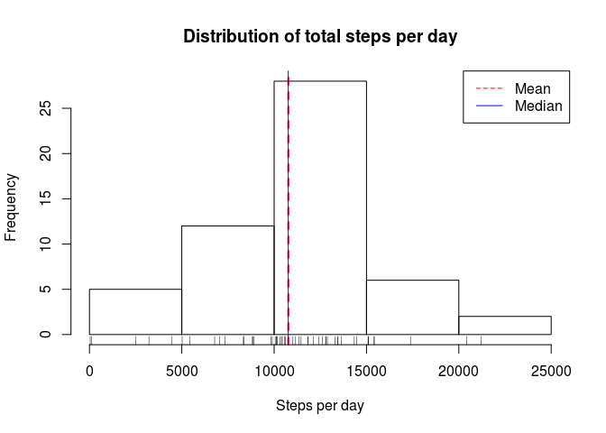
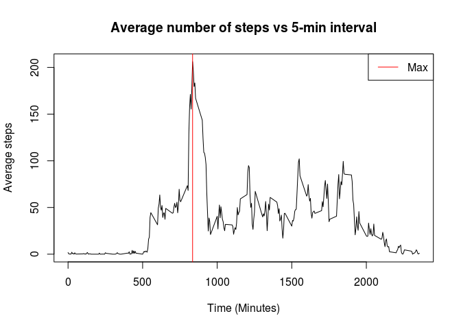
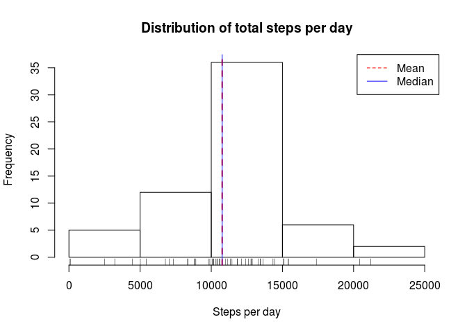
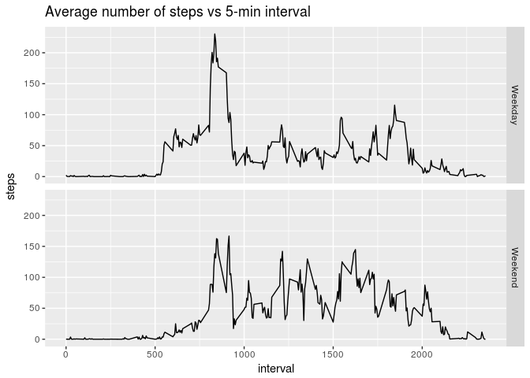

## Loading and preprocessing the data

```r
setwd("/home/stefan/datasciencecoursera/Course5_ReproducibleResearch/RepData_PeerAssessment1/") #set your own working directory
df_ori <- read.csv("activity.csv") #read csv, and store it in dataframe called df
df <- subset(df_ori, is.na(steps) == FALSE) # Remove any NA values
```


## What is mean total number of steps taken per day?
First, we want to form vector of sum of steps per day. We can do this by applying `tapply` function, and removing NA values. We store this vector in a variable called `sum_per_day`.

```r
sum_per_day <- as.vector(with(df, tapply(steps, date, sum)))
sum_per_day <- sum_per_day[!is.na(sum_per_day)]
```
Let's take a look at summary of `sum_per_day`.

```r
summary(sum_per_day)
```

```
##    Min. 1st Qu.  Median    Mean 3rd Qu.    Max. 
##      41    8841   10765   10766   13294   21194
```
From this summary table, we know that median and mean of the total steps per day are very close, i.e. 10765 and 10766. The histogram below shows the distribution of total steps per day.

```r
hist(sum_per_day, breaks = 5, main = "Distribution of total steps per day", xlab = "Steps per day")
rug(sum_per_day)
abline(v = mean(sum_per_day), col = "red", lty = 2, lwd = 2)
abline(v = median(sum_per_day), col = "blue")
legend("topright", col = c("red", "blue"), legend = c("Mean", "Median"), lty= c(2,1))
```

<!-- -->


## What is the average daily activity pattern?  
We create data frame with 2 variables: average steps in 5 minute interval, and interval.

```r
avg_min <- as.data.frame(with(df, tapply(steps, interval, mean)))
avg_min <- cbind(avg_min, unique(df$interval))
names(avg_min) <- c("steps", "interval")
head(avg_min)
```

```
##        steps interval
## 0  1.7169811        0
## 5  0.3396226        5
## 10 0.1320755       10
## 15 0.1509434       15
## 20 0.0754717       20
## 25 2.0943396       25
```
Then we make time series plot, with vertical line indicating its maximum value.

```r
plot(x = avg_min$interval, y = avg_min$steps, type = "l", main = "Average number of steps vs 5-min interval", xlab = "Time (Minutes)", ylab = "Average steps")
abline(v = avg_min$interval[which.max(avg_min$steps)], col = "red")
legend("topright", col = "red", legend = "Max", lty = 1)
```

<!-- -->


```r
avg_min$interval[which.max(avg_min$steps)]
```

```
## [1] 835
```

The maximum average steps happens in min 835.


## Imputing missing values  
Calculate and report the total number of missing values in the dataset (i.e. the total number of rows with NAs). In this dataset, NA is only in `steps` column.

```r
sum(is.na(df_ori$steps))
```

```
## [1] 2304
```
There are 2304 rows with NA in the dataset. 

Interestingly, NAs occur in all of intervals for specific dates , if exist. This can be concluded by comparing output of these code chunks:

```r
sum_per_day <- with(df, tapply(steps, date, sum)) #NA removed beforehand
sum_per_day1 <- with(df_ori, tapply(steps, date, sum)) #NA not removed

sum_per_day
```

```
## 2012-10-01 2012-10-02 2012-10-03 2012-10-04 2012-10-05 2012-10-06 
##         NA        126      11352      12116      13294      15420 
## 2012-10-07 2012-10-08 2012-10-09 2012-10-10 2012-10-11 2012-10-12 
##      11015         NA      12811       9900      10304      17382 
## 2012-10-13 2012-10-14 2012-10-15 2012-10-16 2012-10-17 2012-10-18 
##      12426      15098      10139      15084      13452      10056 
## 2012-10-19 2012-10-20 2012-10-21 2012-10-22 2012-10-23 2012-10-24 
##      11829      10395       8821      13460       8918       8355 
## 2012-10-25 2012-10-26 2012-10-27 2012-10-28 2012-10-29 2012-10-30 
##       2492       6778      10119      11458       5018       9819 
## 2012-10-31 2012-11-01 2012-11-02 2012-11-03 2012-11-04 2012-11-05 
##      15414         NA      10600      10571         NA      10439 
## 2012-11-06 2012-11-07 2012-11-08 2012-11-09 2012-11-10 2012-11-11 
##       8334      12883       3219         NA         NA      12608 
## 2012-11-12 2012-11-13 2012-11-14 2012-11-15 2012-11-16 2012-11-17 
##      10765       7336         NA         41       5441      14339 
## 2012-11-18 2012-11-19 2012-11-20 2012-11-21 2012-11-22 2012-11-23 
##      15110       8841       4472      12787      20427      21194 
## 2012-11-24 2012-11-25 2012-11-26 2012-11-27 2012-11-28 2012-11-29 
##      14478      11834      11162      13646      10183       7047 
## 2012-11-30 
##         NA
```

```r
sum_per_day1
```

```
## 2012-10-01 2012-10-02 2012-10-03 2012-10-04 2012-10-05 2012-10-06 
##         NA        126      11352      12116      13294      15420 
## 2012-10-07 2012-10-08 2012-10-09 2012-10-10 2012-10-11 2012-10-12 
##      11015         NA      12811       9900      10304      17382 
## 2012-10-13 2012-10-14 2012-10-15 2012-10-16 2012-10-17 2012-10-18 
##      12426      15098      10139      15084      13452      10056 
## 2012-10-19 2012-10-20 2012-10-21 2012-10-22 2012-10-23 2012-10-24 
##      11829      10395       8821      13460       8918       8355 
## 2012-10-25 2012-10-26 2012-10-27 2012-10-28 2012-10-29 2012-10-30 
##       2492       6778      10119      11458       5018       9819 
## 2012-10-31 2012-11-01 2012-11-02 2012-11-03 2012-11-04 2012-11-05 
##      15414         NA      10600      10571         NA      10439 
## 2012-11-06 2012-11-07 2012-11-08 2012-11-09 2012-11-10 2012-11-11 
##       8334      12883       3219         NA         NA      12608 
## 2012-11-12 2012-11-13 2012-11-14 2012-11-15 2012-11-16 2012-11-17 
##      10765       7336         NA         41       5441      14339 
## 2012-11-18 2012-11-19 2012-11-20 2012-11-21 2012-11-22 2012-11-23 
##      15110       8841       4472      12787      20427      21194 
## 2012-11-24 2012-11-25 2012-11-26 2012-11-27 2012-11-28 2012-11-29 
##      14478      11834      11162      13646      10183       7047 
## 2012-11-30 
##         NA
```

We see that both of them have the same exact values. Comparing the 2 matrices, we know that in the following dates, all `steps` are NA:

```r
NA_date <- sum_per_day[is.na(sum_per_day)]
NA_date <- names(NA_date)
NA_date
```

```
## [1] "2012-10-01" "2012-10-08" "2012-11-01" "2012-11-04" "2012-11-09"
## [6] "2012-11-10" "2012-11-14" "2012-11-30"
```
We will impute NAs in those dates with mean in 5 min interval (similar to what we got from previous question).


```r
avg <- as.vector(with(df, tapply(steps, interval, mean)))
 
for (date in NA_date){
        index_NA <- which(df_ori$date == date)
        df_ori$steps[index_NA] <- avg
}
```

Let's evaluate the mean, median, and its distribution with histogram.


```r
sum_per_day2 <- as.vector(with(df_ori, tapply(steps, date, sum)))
summary(sum_per_day2)
```

```
##    Min. 1st Qu.  Median    Mean 3rd Qu.    Max. 
##      41    9819   10766   10766   12811   21194
```

```r
hist(sum_per_day2, breaks = 5, main = "Distribution of total steps per day", xlab = "Steps per day")
rug(sum_per_day2)
abline(v = mean(sum_per_day2), col = "red", lty = 2, lwd = 2)
abline(v = median(sum_per_day2), col = "blue")
legend("topright", col = c("red", "blue"), legend = c("Mean", "Median"), lty= c(2,1))
```

<!-- -->

From the summary and histogram, we conclude that the distribution, mean, median are almost the same as the first part of this assignment.

## Are there differences in activity patterns between weekdays and weekends?
We add new variable `category`. If it is Saturday or Sunday, we categorize it as "Weekend", else as "Weekday".

```r
df_ori$category <- ifelse((weekdays(as.Date(df_ori$date)) == "Saturday" | weekdays(as.Date(df_ori$date)) == "Sunday"), "Weekend", "Weekday")
```

We create data frame showing average steps per day, grouped by category weekend/weekday, stored in `combined_df`.


```r
df_weekday <- subset(df_ori, category == "Weekday")
df_weekend <- subset(df_ori, category == "Weekend")

avg_min_weekday <- as.data.frame(with(df_weekday, tapply(steps, interval, mean)))
avg_min_weekday <- cbind(avg_min_weekday, unique(df_weekday$interval), "Weekday")
names(avg_min_weekday) <- c("steps", "interval", "category")

avg_min_weekend <- as.data.frame(with(df_weekend, tapply(steps, interval, mean)))
avg_min_weekend <- cbind(avg_min_weekend, unique(df_weekend$interval), "Weekend")
names(avg_min_weekend) <- c("steps","interval", "category")

combined_df <- rbind(avg_min_weekday, avg_min_weekend)
```

Plot the time series.

```r
library(ggplot2)

ggplot(combined_df, aes(interval, steps)) + geom_line() + facet_grid(category~.) + ggtitle ("Average number of steps vs 5-min interval")
```

<!-- -->

Let's see summary of average steps on weekdays

```r
summary(avg_min_weekday$steps)
```

```
##    Min. 1st Qu.  Median    Mean 3rd Qu.    Max. 
##   0.000   2.247  25.803  35.611  50.854 230.378
```
And compare with summary of average steps on weekends

```r
summary(avg_min_weekend$steps)
```

```
##    Min. 1st Qu.  Median    Mean 3rd Qu.    Max. 
##   0.000   1.241  32.340  42.366  74.654 166.639
```

We see that on weekends, mean is greater than on weekdays.
